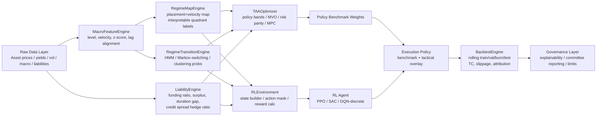
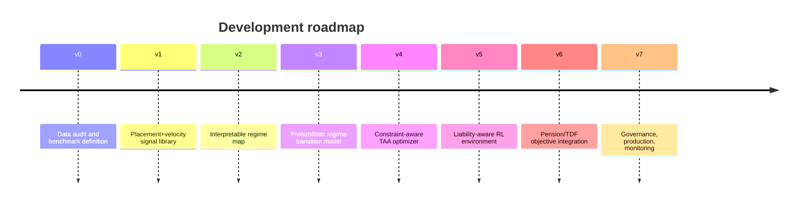

# Placement + Velocity 기반 경기국면 모델과 DP/MDP/RL/MPC 결합 TAA 연구 및 실무 적용

## Executive Summary

본 보고서는 사용자가 지정한 범위와 산출물, 그리고 기본 가정(자산군 미정, 월간 리밸런싱 권고, 가능하면 20년 이상 데이터 활용)을 반영해 작성했다. fileciteturn0file0

핵심 결론부터 말하면, **“placement(수준) + velocity(변화율/기울기)”로 경기국면을 2차원 맵으로 보고, 그 국면별로 자산 배분을 달리한 뒤, 그 위에 DP/MDP/RL/MPC를 얹는 구상은 문헌적으로 충분히 정당화된다**. 다만 기존 연구는 대체로 세 갈래로 분절돼 있다.  
첫째는 **국면을 식별하는 연구**다. entity["organization","OECD","Paris, France | intergovernmental organization"]의 CLI 해석 체계는 “수준(100 위/아래)”과 “변화율(전월 대비 상승/하락)”을 직접 결합해 4개 성장 국면으로 해석한다. 이는 placement+velocity 아이디어와 거의 일치한다. citeturn33view0  
둘째는 **국면 전이를 자산배분에 연결하는 연구**다. Guidolin–Timmermann, Bae–Kim–Mulvey, Oliveira et al.은 HMM, regime-switching, clustering 기반 macro regime probability를 이용해 동적 배분 또는 TAA를 수행한다. citeturn16view2turn16view0turn11view2turn37view0turn37view2  
셋째는 **다기간 제어와 부채 연동 목적함수 연구**다. entity["organization","Society of Actuaries","Chicago, IL, USA | professional actuarial organization"]의 LDI 보고서, Jang et al., Giamouridis et al., McCarthy–Miles는 funding ratio, surplus, contribution, liability constraints를 포함한 동적 최적화·확률계획·동적계획 관점을 제공한다. citeturn26view0turn16view1turn29view0turn29view1

따라서 **실무적으로 가장 유망한 구조는 “해석 가능한 placement+velocity 국면맵”과 “확률적 전이/제어 엔진”의 2층 구조**다.  
윗단은 placement+velocity로 현재 국면을 설명하고, 아랫단은 MPC나 RL이 그 국면 확률과 제약을 반영해 실제 weight를 내는 방식이다. 이렇게 해야 CIO/OCIO/연금위원회에 설명 가능성을 유지하면서도, 단순 사분면 heuristic보다 더 엄격한 다기간 최적화를 구현할 수 있다. citeturn33view0turn16view0turn20view0turn11view2turn26view0

사용자가 필수 참조로 지정한 entity["event","ICAPS 2023","AI planning conference | required reference"]의 urlDeep Reinforcement Learning for Optimal Portfolio Allocation: A Comparative Study with Mean-Variance Optimizationturn0search3은 이 아이디어를 실전형으로 옮기는 데 가장 좋은 교량이다. 이 논문은 관측 상태에 **60일 수익률 lookback, 포트폴리오 weights, vol20, vol60, vol20/vol60, VIX**를 넣고, **long-only softmax action**, **Differential Sharpe reward**, **train–burn–test sliding windows**, **expanding-window standardization**을 사용한다. 즉 이미 “국면 상태 변수 + MDP + 온라인 학습”의 골격을 제공한다. 다만 원 논문은 **거래비용이 없고, 즉시 리밸런싱을 허용**하며, 비교대상도 일간 MVO 중심이라 연금/TDF/LDI에 그대로 쓰기엔 부족하다. citeturn12view0turn12view1turn12view2turn12view5turn13view0turn13view3

연금/OCIO/TDF 관점에서 가장 중요한 수정점은 분명하다. **목표함수를 “수익률”에서 “정책 목적”으로 바꿔야 한다.**  
TDF는 은퇴 시점 성공확률, downside, glide-path 일관성이 중심이어야 하고, DB/LDI는 funding ratio, surplus, duration gap, credit-spread hedge ratio, contribution stability, downside shortfall이 중심이어야 한다. Differential Sharpe는 tactical sleeve나 보조항으로 유용하지만, 부채가 있는 구조의 주목적함수로 단독 사용하면 목적 misalignment가 발생할 가능성이 크다. citeturn26view0turn25view4turn36view0turn36view1turn16view1

가장 높은 실무 적합도를 보인 문헌군은 두 가지다.  
하나는 urlDeep Learning for Liability-Driven Investmentturn4search0과 urlLiability-driven investment for pension funds: stochastic optimization with real assetsturn15search3처럼 **부채를 state/reward/constraint에 직접 포함하는 연금·LDI 문헌**이다. 다른 하나는 urlMulti-Period Portfolio Optimization using Model Predictive Control with Mean-Variance and Risk Parity Frameworksturn19academia9, urlTactical Asset Allocation with Macroeconomic Regime Detectionturn2search4, urlRegime-Switching Asset Allocation Using a Framework Combing a Jump Model and Model Predictive Controlturn39search0처럼 **regime→forecast→multi-period control**을 구현하는 문헌이다. 이 둘을 결합하는 것이 사용자의 아이디어와 가장 잘 맞는다. citeturn26view0turn16view1turn20view0turn37view1turn38view3turn38view4

실무 구현 우선순위는 **월간 macro regime map → liability-aware MPC → RL overlay** 순서가 가장 타당하다. RL을 처음부터 메인 엔진으로 두기보다, 먼저 placement+velocity 기반 regime map과 liability-aware benchmark 정책을 세운 뒤, RL을 “비선형 corrective overlay”로 붙이는 편이 reward hacking, 설명 가능성 저하, 과최적화 위험을 크게 줄인다. citeturn33view0turn20view0turn26view0turn12view5turn38view0

## Placement와 Velocity 아이디어가 기존 문헌에 어떻게 연결되는가

직접적으로 맞닿는 가장 강한 근거는 entity["organization","OECD","Paris, France | intergovernmental organization"] CLI 해석 체계다. 이 체계에서는 **placement**가 CLI level의 100 대비 위치이고, **velocity**가 전월 대비 상승/하락이다. OECD는 이 두 축으로 expansion, downturn, slowdown, recovery라는 4개 성장 국면을 정의한다. 즉 사용자의 “좌표별 포지션 설정” 아이디어는 이미 공적 통계기관의 경기국면 해석 논리와 구조적으로 동일하다. citeturn33view0turn34view0

역사적인 practitioner 전통으로는 urlThe Investment Clockturn9search0이 가장 가깝다. 이 프레임은 output gap 방향과 inflation 방향을 결합해 reflation, recovery, overheat, stagflation을 정의하고, 각 단계에 bonds, stocks, commodities, cash의 상대 우위를 연결한다. 시각적으로는 ‘clock’이지만, 수학적으로는 사실상 **phase-plane 해석의 투자 버전**이다. 다만 이 전통은 설명력이 강한 대신, 보통 전이확률·거래비용·부채제약·다기간 목적함수까지 엄밀히 포함하지는 못한다. citeturn11view9

현대 문헌으로 가면, 2차원 국면맵은 종종 더 은닉된 형태로 바뀐다. urlAsset Allocation under Multivariate Regime Switchingturn15search1과 urlDynamic asset allocation for varied financial markets under regime switching frameworkturn15search0는 2D 사분면을 그대로 쓰기보다, 시장이 crash/slow growth/bull/recovery 같은 여러 상태 사이를 전이한다고 놓고, 투자자는 관측된 데이터로 state probability를 필터링한다. 즉 **눈으로 보이는 phase-plane**이 **확률적 latent state model**로 진화한 셈이다. citeturn16view2turn16view0

사용자의 아이디어와 특히 가까운 것은 “수준 + 변화율”을 **macro뿐 아니라 volatility와 risk state에도 확장**하는 방식이다. urlDeep Reinforcement Learning for Optimal Portfolio Allocation: A Comparative Study with Mean-Variance Optimizationturn0search3은 state에 vol20, vol60, vol20/vol60, VIX를 넣는다. 여기서 vol20과 VIX는 ‘현재 변동성의 placement’를, vol20/vol60은 ‘단기 대비 장기 변동성의 velocity’를 나타낸다고 볼 수 있다. 사용자가 생각한 placement+velocity 국면맵을 “경기” 대신 “변동성/위험” 공간으로 옮긴 예다. citeturn12view0turn14view0

또 다른 practitioner 근거는 urlA Half Century of Macro Momentumturn5search0과 urlAdaptive multi-factor allocationturn4search2이다. 전자는 **1년 변화한 GDP 성장률 전망과 1년 변화한 인플레이션 전망**을 business-cycle 신호로 쓰며, 후자는 macro cycle과 momentum을 별도 pillar로 결합한다. 이는 placement+velocity를 “위치 + 기울기”, 혹은 “state + trend”의 조합으로 쓰는 실무 intuition이 충분히 일반화되어 있음을 보여준다. citeturn35view0turn35view2turn24view0turn24view1

### 문헌 매핑 요약

| 사용자의 개념 | 문헌상 대응 개념 | 대표 근거 | 실무 해석 |
|---|---|---|---|
| placement | level vs trend, output gap, CLI above/below 100, volatility level | urlInterpreting OECD Composite Leading Indicatorsturn21search0, urlThe Investment Clockturn9search0, urlICAPS 2023 DRL paperturn0search3 | “지금 경제/시장 레벨이 어디에 있는가?” |
| velocity | month-on-month CLI change, slope, momentum, vol20/vol60, 1y change in GDP/CPI forecasts | urlInterpreting OECD Composite Leading Indicatorsturn21search0, urlA Half Century of Macro Momentumturn5search0, urlICAPS 2023 DRL paperturn0search3 | “그 위치에서 얼마나 빨리/어느 방향으로 이동 중인가?” |
| phase-plane | 2x2 growth phases, investment clock quadrants | urlInterpreting OECD Composite Leading Indicatorsturn21search0, urlThe Investment Clockturn9search0 | 해석 가능한 regime map |
| DP/MDP/RL/MPC 결합 | latent regime probabilities + multi-period control + policy learning | urlAsset Allocation under Multivariate Regime Switchingturn15search1, urlMulti-Period Portfolio Optimization using Model Predictive Control with Mean-Variance and Risk Parity Frameworksturn19academia9, urlDeep Learning for Liability-Driven Investmentturn4search0 | 별도 층으로 결합하는 편이 가장 자연스러움 |

이 매핑에서 중요한 포인트는 하나다. **직접적으로 “placement+velocity 사분면 + pension-ready RL”을 한 번에 구현한 논문은 거의 없고, 대부분은 해석 계층과 최적화 계층이 분리돼 있다**. 따라서 연구적으로는 공백이 있고, 실무적으로는 오히려 그 공백이 사용자 전략팀에게 차별화 포인트가 될 수 있다. citeturn33view0turn16view0turn20view0turn26view0

## 가장 관련성 높은 연구와 실무 문헌

### 실무 적합도 기준 상위 문헌

| 실무 순위 | 문헌 | 저자 | 연도 | 유형 | 실무 적합도 포인트 |
|---|---|---|---|---|---|
| 1 | urlDeep Learning for Liability-Driven Investmentturn4search0 | Fei Xie et al. | 2021 | practitioner / LDI | state·action·reward를 연금 LDI 언어로 직접 정의 citeturn26view0 |
| 2 | urlLiability-driven investment for pension funds: stochastic optimization with real assetsturn15search3 | Chul Jang, Andrew Clare, Iqbal Owadally | 2024 | academic / LDI | funding ratio, contribution, buyout cost, downside shortfall을 함께 다룸 citeturn16view1 |
| 3 | urlDeep Reinforcement Learning for Optimal Portfolio Allocation: A Comparative Study with Mean-Variance Optimizationturn0search3 | Srijan Sood et al. | 2023 | academic / RL | vol20·vol60·VIX state, Differential Sharpe, rolling backtest 설계 citeturn12view0turn13view0 |
| 4 | urlMulti-Period Portfolio Optimization using Model Predictive Control with Mean-Variance and Risk Parity Frameworksturn19academia9 | Xiaoyue Li, A. Sinem Uysal, John Mulvey | 2021 | academic / MPC | multi-period control을 실무 배분 엔진으로 구현 citeturn20view0 |
| 5 | urlDynamic asset allocation for varied financial markets under regime switching frameworkturn15search0 | Geum Il Bae, Woo Chang Kim, John Mulvey | 2014 | academic / regime switching | HMM + stochastic program의 교과서적 연결 citeturn16view0 |
| 6 | urlTactical Asset Allocation with Macroeconomic Regime Detectionturn2search4 | Daniel C. Oliveira et al. | 2025 | academic / macro TAA | macro data(FRED-MD)에서 regime를 뽑아 TAA에 연결 citeturn37view1turn37view2 |
| 7 | urlAsset Allocation under Multivariate Regime Switchingturn15search1 | Massimo Guidolin, Allan Timmermann | 2007 | academic / regime switching | state probability 기반 자산배분의 핵심 근간 citeturn16view2 |
| 8 | urlDynamic Asset Allocation with Liabilitiesturn7search3 | Daniel Giamouridis, Athanasios Sakkas, Nikolaos Tessaromatis | 2017 | academic / liability-aware | liabilities 포함 multi-period choice의 해석적 해답 citeturn29view0 |
| 9 | urlAdaptive multi-factor allocationturn4search2 | H. D. Varsani et al. | 2018 | practitioner / factor TAA | macro cycle + momentum + valuation + sentiment의 실무형 조합 citeturn24view0turn24view3 |
| 10 | urlRevisiting pension asset allocationturn5search11 | Vanguard authors | 2021 | practitioner / pension | funding-status driven dynamic glide path 구조를 명시 citeturn36view0turn36view1 |

### 상세 비교

| 문헌 | 핵심 모델 구조 | 사용 지표 | state 정의 | action 정의 | reward / objective | 최적화 방법 | benchmark | 거래비용·회전율·제약 처리 | 실무 적용성 | 한계 | 차용 아이디어 |
|---|---|---|---|---|---|---|---|---|---|---|---|
| urlDeep Learning for Liability-Driven Investmentturn4search0 | actuarial ALM simulator 위에 RL/NN/LSTM | 경제요인, 자산수익률, surplus | 현재+과거 분기 경제요인·자산수익률·surplus | 현재 mix 유지/소폭 조정/전체 action set | 자산수익률, funding ratio 변화, funding surplus 변화 | RL + NN/LSTM 근사 | 정적 효율적 프런티어/benchmark 전략 | allocation upper bound, 2% step 제약, TC·impact 고려형 action design | **연금 LDI에 가장 직결** | regime map이 명시적이지 않음 | liability-aware RL env 설계의 출발점 citeturn26view0turn27view1turn28view0 |
| urlLiability-driven investment for pension funds: stochastic optimization with real assetsturn15search3 | closed DB fund용 multi-stage stochastic program | 금리, real assets, liabilities | planning horizon별 asset-liability node | strategic allocation, contribution, hedge mix | contribution·funding ratio·buyout cost 동시 최적화, asset-liability ES 제약 | MSP | duration-convexity matching, aggregate bond index tracking | downside shortfall 제약, illiquidity 고려 | **DB/LDI 목적함수 설계에 최고 수준** | RL/online control 아님 | RL reward와 MPC constraint를 설계할 때 목표함수 템플릿 제공 citeturn16view1 |
| urlDeep Reinforcement Learning for Optimal Portfolio Allocation: A Comparative Study with Mean-Variance Optimizationturn0search3 | market replay + PPO agent | 60일 log returns, vol20, vol60, vol20/vol60, VIX | weights + return lookback + volatility regime indicators | long-only, non-levered softmax weights | Differential Sharpe | MDP / PPO | MVO | 원문은 TC 없음, 즉시 리밸런싱; turnover metric 별도 관찰 | **RL TAA 골격** | liability·TC·drawdown·macro release lag 부재 | 사용자의 placement+velocity를 state space로 넣는 가장 좋은 prototype citeturn12view0turn12view1turn12view2turn12view5turn13view0turn13view3 |
| urlMulti-Period Portfolio Optimization using Model Predictive Control with Mean-Variance and Risk Parity Frameworksturn19academia9 | receding-horizon multi-period optimizer | multi-asset return/cov forecasts | 현재 weights + horizon forecasts | horizon 내 reallocation path | mean-variance 또는 risk parity | MPC / successive convex programming | fixed-mix | 현실적 제약 포함 가능한 convex framework | **OCIO/위원회 친화적** | regime map을 내장하지는 않음 | regime forecast를 넣는 TAAOptimizer의 핵심 엔진으로 적합 citeturn20view0 |
| urlDynamic asset allocation for varied financial markets under regime switching frameworkturn15search0 | HMM + scenario generation + stochastic program | varied financial market returns | unobservable market regimes | portfolio weights | uncertainty 하 optimal portfolio | HMM / stochastic programming | 정적 mean-variance 대비 frame 확장 | regime uncertainty 자체를 구조화 | **regime→optimizer 연결의 전형** | liability 목적함수 없음 | RegimeTransitionEngine과 scenario tree 설계에 적합 citeturn16view0 |
| urlTactical Asset Allocation with Macroeconomic Regime Detectionturn2search4 | modified k-means + regime forecast + sizing scheme | FRED-MD 127개 macro series, ETF returns | macro regime probabilities | equal-weight / long-only / long-short / tactical short-tilt sizing | expected Sharpe / forecast-based allocation | clustering + regime forecast + allocation mapping | equal-weight, buy-and-hold, random regime, MVO | standardization·regime uncertainty 고려 | **macro regime map 실무화에 매우 유용** | liability layer 없음 | MacroFeatureEngine·RegimeMapEngine 설계에 최적 citeturn37view0turn37view1turn37view2turn37view4turn37view5 |
| urlAsset Allocation under Multivariate Regime Switchingturn15search1 | multivariate regime-switching return model | stock/bond joint returns | filtered crash/slow growth/bull/recovery probabilities | horizon별 optimal stock-bond allocation | expected utility / intertemporal asset allocation | regime switching / dynamic allocation | buy-and-hold류 조건부 비교 | long-horizon state dependence 강조 | **이론적 기반이 매우 강함** | 직접적인 구현 recipe는 덜 친절 | 경기국면별 strategic override의 이론적 정당화 citeturn16view2 |
| urlDynamic Asset Allocation with Liabilitiesturn7search3 | analytical multi-period liability-aware portfolio choice | time-varying returns, risky liabilities | 투자기회집합 + liabilities | dynamic weights | liability-aware portfolio choice | analytical dynamic optimization | myopic ALM 비교 | funding ratio constraints 언급 | **부채 포함 다기간 사고를 강화** | 구현보다는 해석 중심 | TDF보다 DB/annuity형 liability objective에 유용 citeturn29view0 |
| urlAdaptive multi-factor allocationturn4search2 | top-down adaptive factor mix 4 pillars | macro cycle, momentum, valuation, sentiment | pillar별 signal state | factor allocation tilts | active return / active risk 개선 | rule-based adaptive allocation | static strategic factor mix | turnover 비교 포함 | **OCIO식 overlay에 현실적** | liability 없음, asset-level TAA 아님 | placement(거시/valuation)+velocity(momentum) 혼합 구조 참고 citeturn24view0turn24view1turn24view3 |
| urlRevisiting pension asset allocationturn5search11 | funding-status driven dynamic glide path | funding ratio, interest-rate risk, credit spread risk, VaR | plan funding status | return-seeking allocation target, IR hedge ratio, credit spread hedge ratio | downside funding-status risk 관리 | policy / glide path design | custom AL study benchmark | funding trigger 기반 전환 | **위원회/기업연금 의사결정 친화적** | RL/DP 아님 | pension policy benchmark와 RL benchmark를 연결하는 데 결정적 citeturn36view0turn36view1 |

이 표에서 보이는 패턴은 명확하다. **국면 식별 문헌은 macro/market state를 잘 잡지만 liability 목적함수가 약하고, 연금·LDI 문헌은 objective가 훌륭하지만 regime map이 약하다.** 사용자의 아이디어는 정확히 이 둘을 잇는 접점에 있다. citeturn16view0turn37view1turn26view0turn16view1

## ICAPS 2023 논문을 pension/TDF/LDI에 맞게 바꾸는 방법

원 논문의 강점은 세 가지다.  
첫째, RL 문제를 **명시적 MDP**로 두고, state·action·reward를 분해했다. 둘째, state에 이미 **volatility placement+velocity**가 들어 있다. 셋째, **rolling train / burn / test**와 **expanding-window standardization**으로 금융 시계열의 non-stationarity와 leakage 문제를 꽤 잘 다뤘다. citeturn12view0turn12view1turn13view0turn13view3

반대로 연금/TDF/LDI에 그대로 쓰기 어려운 지점도 세 가지다.  
첫째, 거래비용이 없고 즉시 리밸런싱을 허용한다. 둘째, reward가 Differential Sharpe 중심이라 liability-aware 목적과 어긋날 수 있다. 셋째, benchmark가 MVO 중심이라 **정적 글라이드패스, funding-status glide path, liability hedge benchmark, contribution policy benchmark**와의 비교가 빠져 있다. 흥미롭게도 원 논문 자체도 future work에서 transaction costs, slippage, drawdown minimization, 그리고 low-vol/high-vol agent 분할을 후속 과제로 제시한다. 이는 연금형 응용이 요구하는 방향과 거의 같다고 볼 수 있다. citeturn12view5

### 원 논문과 연금형 응용의 대응표

| 구성요소 | ICAPS 2023 원형 | pension/TDF/LDI 전환안 |
|---|---|---|
| 관측 빈도 | 일간 | **월간 기본**, 필요시 분기 |
| state | weights, 60일 returns, vol20, vol60, vol20/vol60, VIX | 기존 state + CLI level/change, PMI level/change, inflation level/change, term spread, credit spread, funding ratio, surplus, duration gap, hedge ratio, time-to-retirement |
| regime 해석 | low/high volatility가 암묵적으로 state에 내장 | **해석 가능한 placement+velocity regime map**을 별도 계층으로 분리 |
| action | full portfolio long-only weights | strategic benchmark 대비 active tilt, de-risking step, overlay hedge ratio 조정 |
| reward | Differential Sharpe | TDF: success probability·drawdown·turnover / Pension: funding ratio·surplus·hedge mismatch·contribution stability |
| benchmark | MVO | static SAA, strategic glide path, funding-trigger glide path, liability hedge, MVO, risk parity, equal-weight, MPC |
| validation design | 5y train + 1y burn + 1y test, sliding windows | **10~12y train + 2~3y validation + 1y burn + 1y test**, annual roll 권고 |
| costs/constraints | 미포함 | fixed bps + spread/slippage + turnover penalty + max active weight + illiquidity lag |

이 대응에서 가장 중요한 설계 원칙은 **“RL이 전략을 새로 발명하게 하지 말고, benchmark 정책을 교정하게 하라”**는 점이다.  
연금과 TDF에서는 정책 일관성과 설명 가능성이 중요하다. 따라서 RL action space를 전체 weight simplex로 넓게 열기보다, **기준 글라이드패스 또는 기준 LDI hedge policy 주변의 허용 오차 범위** 안에서만 움직이게 하는 편이 실무적으로 훨씬 낫다. 이 발상은 urlRevisiting pension asset allocationturn5search11의 funding-status glide path, urlBlackRock LifePath Dynamic 2035 annual reportturn31search3의 GTAA 내장형 글라이드패스, 그리고 urlDeep Learning for Liability-Driven Investmentturn4search0의 action discretization과 자연스럽게 이어진다. citeturn36view0turn36view4turn27view1

## 실무형 목표함수와 백테스트 설계

### TDF와 pension/LDI에 권고하는 reward 설계

아래 reward는 “단일 reward”보다 **주목적 + 보조항** 구조로 쓰는 것이 좋다. 특히 Differential Sharpe는 tactical sleeve에는 좋지만, 부채가 포함된 전략 전체의 최상위 목적함수로 두기보다는 보조항으로 두는 편이 정합성이 높다. citeturn12view1turn25view4turn16view1

| 대상 | 권고 reward 예시 | 장점 | 단점 / 주의 |
|---|---|---|---|
| TDF | \(r_t=\Delta P(\text{retirement success})+\lambda_{ds}D_t-\lambda_{dd}DD_t-\lambda_{to}\|\Delta w_t\|_1\) | 은퇴성공확률, risk-adjusted return, drawdown, turnover를 동시에 반영 | success probability proxy를 잘 정의해야 함 |
| TDF | \(r_t=R_t^{net}-\lambda_{dd}\max(0,DD_t-DD^*)-\lambda_{glide}\|w_t-w_t^{GP}\|^2\) | glide path 일관성 유지에 좋음 | 너무 강한 glide penalty면 tactical alpha가 죽음 |
| Pension / LDI | \(r_t=\Delta \log(FR_t)-\lambda_{es}ES[(A_t-L_t)^-]-\lambda_{dur}|DG_t|-\lambda_{to}\|\Delta w_t\|_1\) | funding ratio, downside shortfall, duration-gap, turnover를 직접 반영 | calibration이 어렵고 state engineering이 중요 |
| Pension / LDI | \(r_t=\Delta Surplus_t-\lambda_c Var(\text{Contribution}_{t:t+h})-\lambda_{hedge}|HR_t-HR_t^*|\) | sponsor 관점 contribution stability 반영 가능 | sponsor vs trustee objective 충돌 가능 |
| Tactical sleeve 공통 보조항 | Differential Sharpe \(D_t\) | online RL 학습 안정성에 유리 | liability mismatch를 직접 반영하지 못함 |

실무적으로는 다음 조합이 가장 현실적이다.  
**TDF**는 “retirement success proxy + drawdown penalty + turnover penalty + glide-path deviation penalty”가 기본이고, **DB/LDI**는 “funding ratio 또는 surplus 개선 + asset-liability shortfall penalty + hedge mismatch penalty + turnover penalty”가 기본이어야 한다. Differential Sharpe는 양쪽 모두에서 tactical signal의 품질을 보조하는 항으로 쓰되, 최상위 objective는 아니다. citeturn25view4turn16view1turn36view0turn36view2

### 권고 백테스트 설계

연금·OCIO 관점에서는 **월간 리밸런싱**이 기본값이다. 일간 ICAPS 설계는 섹터 로테이션 같은 tactical sleeve에 유용하지만, macro data release lag와 committee implementation cadence를 고려하면 core portfolio는 월간 또는 분기가 더 적합하다. citeturn33view0turn26view0

권고 프레임은 다음과 같다.

| 항목 | 권고 기본값 |
|---|---|
| 데이터 히스토리 | 가능하면 20년+, 최소 15년 |
| 리밸런싱 | 월간 기본, 헤지 오버레이는 주간까지 가능 |
| outer split | 10~12년 train / 2~3년 validation / 1년 burn / 1년 test |
| roll 방식 | test 종료 후 1년씩 전진 |
| 표준화 | expanding window, 항상 \(t-1\)까지만 사용 |
| macro lag | **실제 공표일 기준 정렬**, revision-aware vintage data 우선 |
| 비교 benchmark | static SAA, policy glide path, funding-status glide path, liability hedge benchmark, EW, RP, MVO, MPC, regime-map heuristic |
| 비용모형 | broker fee + spread + slippage + market impact + illiquidity delay |
| 성과지표 | Annual return, vol, Sharpe, Sortino, max DD, Calmar, net IR, turnover, hit ratio, FR improvement, surplus ES, contribution volatility |

이 설계는 ICAPS의 sliding train/burn/test, Oliveira et al.의 macro-based TAA 비교군, JM-MPC의 frequency robustness, 그리고 연금 practitioner 문헌의 funding-status benchmark 관행을 결합한 것이다. citeturn13view0turn37view2turn38view1turn36view0turn36view1

### 실무 주의사항

- **데이터 빈도 불일치**: 자산은 일간, macro는 월간/분기이므로 mixed-frequency nowcasting 체계가 필요하다. 그렇지 않으면 RL state가 사실상 구식 macro를 반복해서 보게 된다. citeturn33view0turn37view1
- **공표 지연과 수정치 문제**: CLI, PMI, CPI, 고용, GDP 추정치는 publish date와 revision을 반영해야 한다. otherwise look-ahead bias가 생긴다. citeturn33view0
- **국면 라벨링 불안정성**: latent regime 모델은 특정 asset sample에 민감할 수 있으므로, macro-only regime, market-only regime, hybrid regime를 병렬 검증하는 편이 낫다. citeturn16view0turn37view0turn23view0
- **state-space explosion**: macro, market, liability, sponsor objectives를 한 번에 넣으면 차원이 급증한다. 초기에는 interpretable regime map을 low-dimensional summary로 사용해야 한다. citeturn26view0turn37view1
- **reward hacking**: net return이나 Differential Sharpe만 쓰면 hedge mismatch나 funding shortfall을 방치할 수 있다. citeturn12view1turn16view1turn25view4
- **설명 가능성**: committee 보고에서는 “왜 이 weight가 나왔는가”가 중요하므로, 최종 의사결정은 regime label, key feature attribution, benchmark deviation decomposition까지 같이 제공해야 한다. 이 점에서 macro regime map + MPC + constrained RL 구조가 pure black-box RL보다 안전하다. citeturn37view0turn20view0turn36view0

## 제안 아키텍처와 개발 로드맵

아래 아키텍처는 entity["organization","OECD","Paris, France | intergovernmental organization"] CLI의 level+change logic, Oliveira et al.의 macro regime detection, Guidolin/Bae의 regime-transition 관점, MPC 문헌의 receding horizon, SOA/Jang 문헌의 liability-aware objective를 결합한 것이다. citeturn33view0turn37view1turn16view2turn16view0turn20view0turn26view0turn16view1

사용자가 v0..v7 형식을 명시했지만 세부 정의는 별도로 주어지지 않았으므로, 아래에서는 **실무 구현 순서 기준으로 v0..v7을 재구성**했다. fileciteturn0file0

### 단계별 로드맵

| 버전 | 핵심 산출물 | 데이터 필요 | 평가 지표 | 구현 난이도 |
|---|---|---|---|---|
| v0 | benchmark 정의, universe 확정, data dictionary, lag policy | asset total return, yields, vol, macro release calendar, liability CF | 데이터 결측률, lag 정합성, benchmark 재현성 | 낮음 |
| v1 | MacroFeatureEngine: level, slope, ROC, z-score, diffusion index | CLI/PMI/CPI/PPI/고용/credit/term spread/VIX | 신호 안정성, revision sensitivity, monotonicity | 낮음 |
| v2 | RegimeMapEngine: 2D/3D placement+velocity regime map | v1 + historical turning point labels | regime persistence, turnover, intuitive validity | 중간 |
| v3 | RegimeTransitionEngine: HMM / Markov-switching / modified k-means / JM | v2 + return series | transition calibration, out-of-sample regime hit ratio | 중간 |
| v4 | TAAOptimizer: policy band, MVO, risk parity, MPC | expected return/cov, regime probs, constraints | net Sharpe, max DD, turnover, policy deviation | 중간~높음 |
| v5 | RLEnvironment: benchmark-relative action, masked actions, reward engine | v4 + liability states | learning stability, policy consistency, reward decomposition | 높음 |
| v6 | pension/TDF objective integration: FR, surplus, success probability | liability CF, duration, sponsor cash, glide path | FR uplift, surplus ES, contribution vol, retirement success | 높음 |
| v7 | production stack: monitoring, attribution, explanation packs, limit controls | live feeds, model logs, committee templates | drift alerts, exception count, governance SLA | 높음 |

여기서 **v2까지는 해석 가능성**, **v4까지는 투자 가능성**, **v6부터는 기관용 정책 적합성**을 확보하는 단계로 보는 것이 좋다. 특히 v4 이전에 RL로 바로 넘어가는 것은 권하지 않는다. 그 이유는 benchmark 부재 상태의 RL은 과최적화와 설명 불가능성을 동시에 키우기 쉽기 때문이다. citeturn20view0turn26view0turn12view5

## 구현 스켈레톤과 추가 검색 키워드

### Python 모듈 / 클래스 스켈레톤

| 모듈 | 주요 클래스 | 책임 | 입력 | 출력 | 권장 라이브러리 |
|---|---|---|---|---|---|
| `data/loader.py` | `MarketDataLoader`, `MacroReleaseCalendarLoader`, `LiabilityDataLoader` | 가격·macro·liability 데이터 로드 및 시계열 정렬 | raw csv/parquet/api | aligned panel | `pandas`, `polars`, `pyarrow` |
| `features/macro.py` | `MacroFeatureEngine` | level, velocity, z-score, release-lag 반영 feature 생성 | macro panel | feature matrix | `pandas`, `numpy`, `statsmodels` |
| `features/liability.py` | `LiabilityFeatureEngine` | FR, surplus, duration gap, hedge ratio 계산 | liability CF, curve, assets | liability state | `numpy`, `scipy` |
| `regime/map.py` | `RegimeMapEngine` | placement+velocity 사분면/육면체 라벨링 | macro/liability features | interpretable regime labels | `numpy`, `scikit-learn` |
| `regime/transition.py` | `RegimeTransitionEngine` | HMM, Markov-switching, k-means/GMM, jump model wrapper | features, returns | regime probabilities, transition matrix | `hmmlearn`, `pomegranate`, `scikit-learn`, custom |
| `optimizer/mpc.py` | `MPCOptimizer` | multi-period rebalancing path 최적화 | expected returns/cov, regime probs, limits | target weight path | `cvxpy`, `osqp`, `numpy` |
| `optimizer/policy.py` | `PolicyBandAllocator` | benchmark-relative active tilt 제한 | policy weight, active bands | implementable weights | `numpy`, `cvxpy` |
| `rl/env.py` | `PensionTAAEnv`, `TDFEnv` | state/action/reward/constraint environment | market state, liability state | transition, reward | `gymnasium`, `numpy` |
| `rl/agent.py` | `PPOAgent`, `DQNBandAgent`, `SACAgent` | RL policy 학습 | environment | trained policy | `stable-baselines3`, `torch` |
| `backtest/engine.py` | `BacktestEngine`, `RollingWindowRunner` | rolling train/val/burn/test, TC, attribution | model configs, datasets | performance reports | `pandas`, `empyrical`, `pyfolio` 대체 utilities |
| `governance/report.py` | `AttributionReport`, `CommitteePackBuilder` | 국면 설명, benchmark deviation, policy limit 점검 | backtest/live logs | committee pdf/html | `jinja2`, `matplotlib`, `plotly` |

### 권장 검색 키워드

다음 키워드 조합이 후속 심층 조사에 가장 효율적이다.

- `"placement velocity business cycle asset allocation"`
- `"level and momentum macro regime tactical asset allocation"`
- `"OECD CLI above below 100 month-on-month asset allocation"`
- `"business cycle phase plane portfolio allocation"`
- `"investment clock regime switching tactical asset allocation"`
- `"vol20 vol60 VIX reinforcement learning portfolio"`
- `"macroeconomic regime detection tactical asset allocation FRED-MD"`
- `"liability aware reinforcement learning pension asset allocation"`
- `"funding ratio reward reinforcement learning pension"`
- `"model predictive control tactical asset allocation regime"`
- `"jump model regime switching portfolio allocation"`
- `"funding-status glide path pension tactical overlay"`
- `"target date fund dynamic glide path tactical asset allocation"`
- `"duration gap reward RL LDI"`
- `"turnover penalized drawdown penalized reward portfolio RL"`

### Open questions / limitations

현재 확보한 문헌으로는 **“placement+velocity를 명시적 phase-plane으로 만들고, 그것을 liability-aware RL/MPC와 end-to-end로 결합한 pension-ready 프레임”** 자체를 정면으로 다룬 단일 대표 논문은 확인되지 않았다. 대신 **OECD/Investment Clock 계열의 해석 로직**, **regime-switching/HMM/clustering 기반 TAA 논문**, **LDI/연금 목적함수 문헌**, **RL/MPC 구현 논문**이 각각 building block을 제공한다는 점이 더 정확한 결론이다. citeturn33view0turn16view0turn37view1turn26view0turn16view1

실무적으로는 이 공백이 오히려 장점일 수 있다.  
왜냐하면 전략팀은 **“설명 가능한 placement+velocity regime map”**을 위원회용 프레임으로 두고, 내부적으로는 **MPC/RL overlay**를 운용하는 하이브리드 구조를 설계할 수 있기 때문이다. 이 구조가 현재 문헌 대비 가장 현실적이고, 동시에 차별화 여지도 크다. citeturn20view0turn36view0turn36view4turn12view5