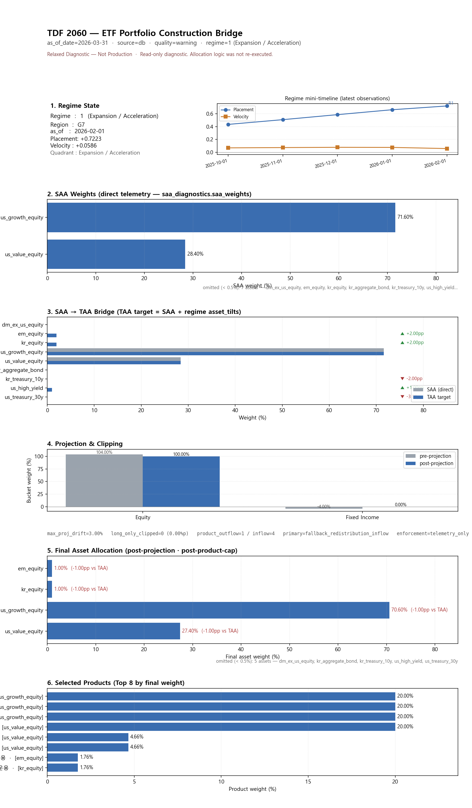
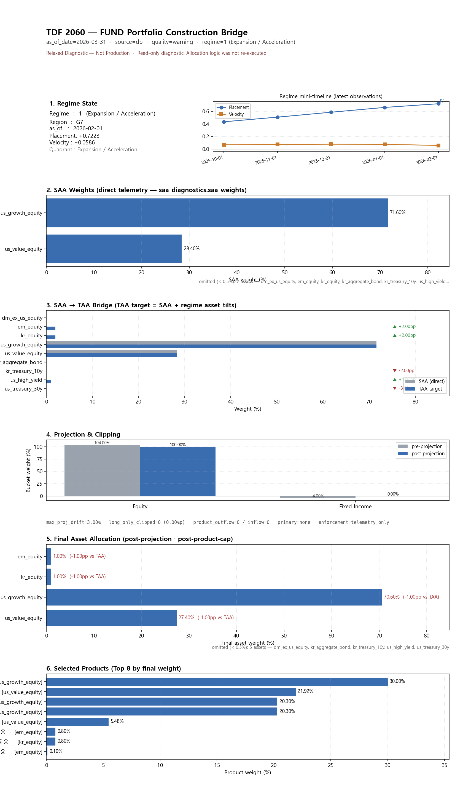

# Portfolio Construction Bridge — Visualization Summary (20260511)

> Relaxed Diagnostic — Not Production
>
> 본 시각화는 relaxed_diagnostic 산출물 해석용이며 production portfolio가 아닙니다. Allocation, TAA, selection 결과를 재계산하지 않고 기존 portfolio JSON을 시각화합니다.

## Run snapshot

| 항목 | ETF | Fund |
|---|---|---|
| equity bucket | 100.00% | 100.00% |
| fixed_income bucket | 0.00% | 0.00% |
| asset_weight_sum | 1.0000 | 1.0000 |
| product_weight_sum | 1.0000 | 1.0000 |
| max_abs_projection_drift | 3.00% | 3.00% |
| max_abs_asset_weight_drift | 10.60% | 0.00% |
| quality_status | warning | warning |
| fallback_used | True | True |
| regime | Expansion / Acceleration (region=G7) | (same) |

## Main: Portfolio Construction Bridge (1-page integrated)

각 PNG 한 페이지 안에서 다음 흐름이 보입니다 — Regime → SAA(direct telemetry) → TAA tilt → Projection → Final asset → Products.

### ETF — `main/00_mvpx_bridge_etf.png`

### Fund — `main/00_mvpx_bridge_fund.png`

## Source

- portfolio_etf_*.json, portfolio_fund_*.json (asset_allocation / product_allocation / diagnostics.{regime,saa_diagnostics,taa_diagnostics,quality})
- MVP-X 는 `diagnostics.saa_diagnostics.saa_weights` (E-6.2 T-6) 를 직접 사용합니다 — inferred SAA (taa_target − asset_tilts) 경로는 사용하지 않습니다.
- 본 summary 는 review_*.md / comparison_*.md / 기존 portfolio_*.json 을 변경하지 않습니다.
