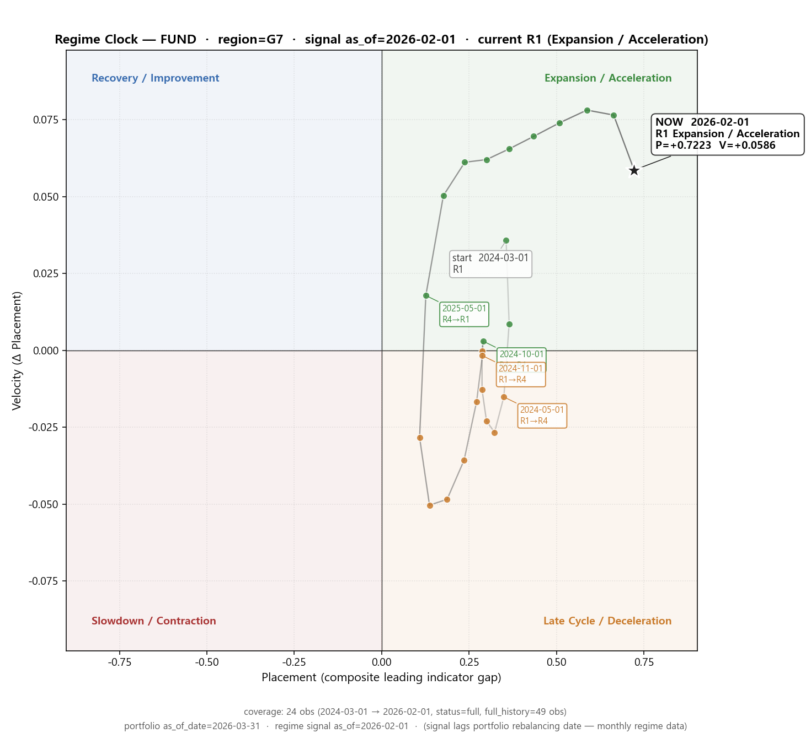

# Regime Clock Visualization Summary (20260511)

> schema_version: e8.1
> Read-only diagnostic — RegimeAnalysisTool re-invoked on the same regime_src.

## ETF

- region: **G7**, signal as_of: **2026-02-01**
- coverage: **full** (24 obs in window, 49 obs full history, target=24m)
- window: 2024-03-01 → 2026-02-01
- current: R1 (Expansion / Acceleration), P=+0.7223 / V=+0.0586
- current_point_match (sidecar last vs portfolio): True

## Fund

- region: **G7**, signal as_of: **2026-02-01**
- coverage: **full** (24 obs in window, 49 obs full history, target=24m)
- window: 2024-03-01 → 2026-02-01
- current: R1 (Expansion / Acceleration), P=+0.7223 / V=+0.0586
- current_point_match (sidecar last vs portfolio): True

