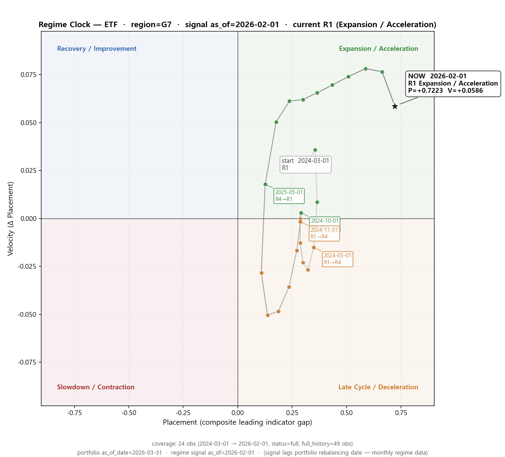
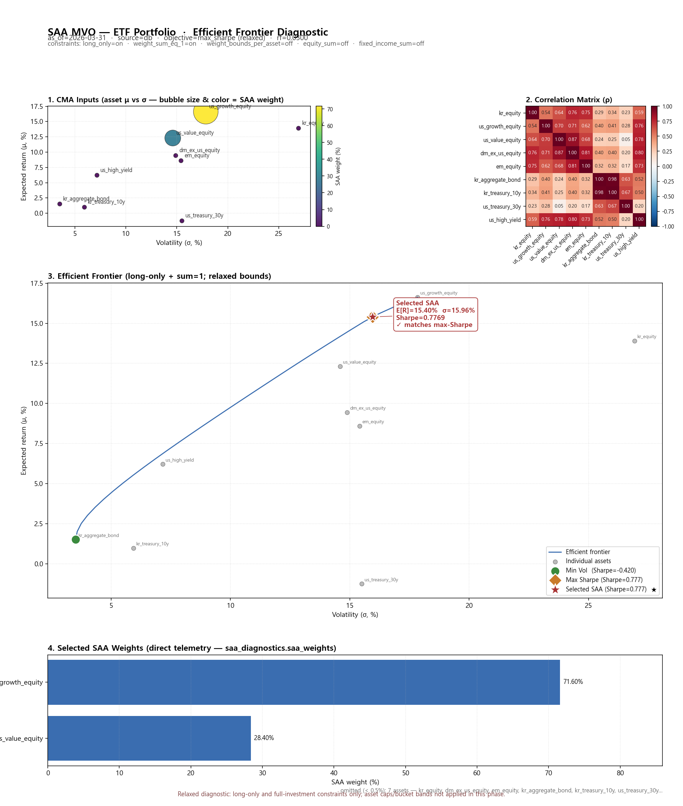
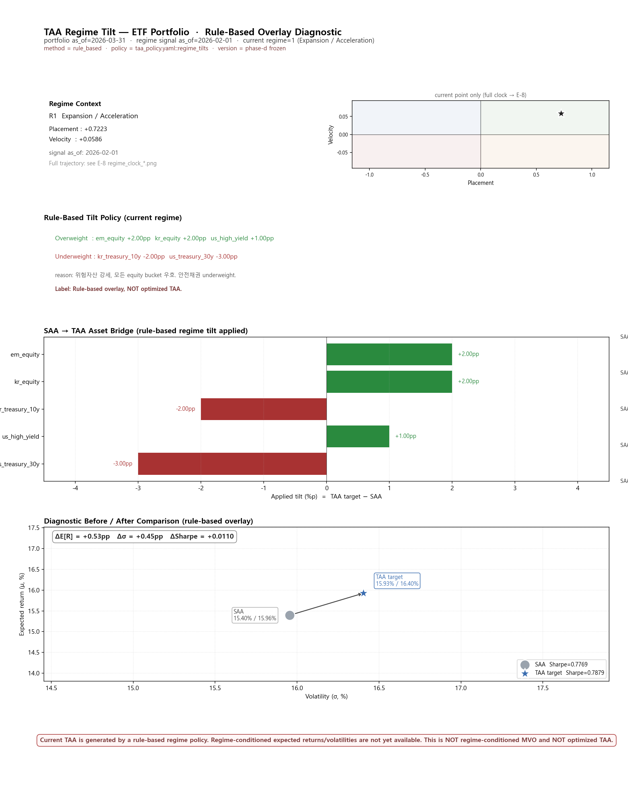
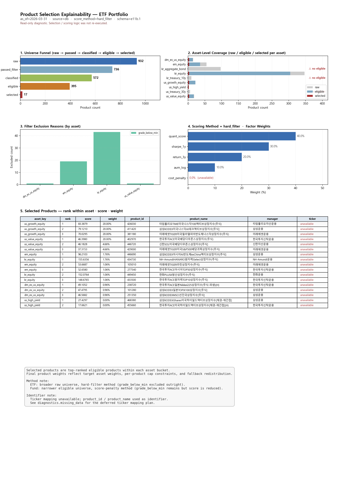

# Integrated Review Packet — TDF 2060 ETF Portfolio

> schema: e12.1
> generated_at: 2026-05-11T07:17:07.673413+00:00  ·  operating_mode: **relaxed_diagnostic**

> **RELAXED DIAGNOSTIC RUN — NOT a production portfolio.**
> - TAA is rule-based regime overlay — NOT regime-conditioned MVO and NOT optimized TAA.
> - Ticker mapping unavailable — product_id / product_name used as identifier.
> - Regime-conditioned assumptions unavailable (deferred to future phase).
> - Efficient frontier sampled by SLSQP grid scan (E-9), not analytical.

## 0. Cover / Run Metadata

| 항목 | 값 |
|---|---|
| product_type | **ETF** |
| portfolio_as_of_date | 2026-03-31 |
| portfolio_as_of_run | 20260511 |
| source_mode | db |
| quality_status | warning |
| operating_mode | relaxed_diagnostic |

## 1. Executive Summary

**ETF** portfolio constructed under regime **R1 (Expansion / Acceleration)**. top SAA weights: us_growth_equity 71.60%, us_value_equity 28.40%, dm_ex_us_equity 0.00%. After rule-based regime tilt (SAA Sharpe 0.7769 → TAA Sharpe 0.7879, Δ=+0.0110), products were selected by quant_score / sharpe_1y / return_3y / aum_log factors. final top: us_growth_equity 70.60%, us_value_equity 27.40%, em_equity 1.00%.

| metric | value |
|---|---|
| current regime | R1 (Expansion / Acceleration) |
| SAA top weights | us_growth_equity 71.60%, us_value_equity 28.40%, dm_ex_us_equity 0.00% |
| TAA target top weights | us_growth_equity 71.60%, us_value_equity 28.40%, em_equity 2.00% |
| Final asset top | us_growth_equity 70.60%, us_value_equity 27.40%, em_equity 1.00% |
| Sharpe SAA → TAA | 0.7769 → 0.7879 (Δ=0.0110) |

**Caveats**:
- Relaxed diagnostic — NOT a production portfolio.
- TAA is rule-based regime overlay — NOT regime-conditioned MVO and NOT optimized TAA.
- Ticker mapping unavailable — product_id / product_name used as identifier.
- Regime-conditioned assumptions unavailable (deferred to future phase).
- Efficient frontier sampled by SLSQP grid scan (E-9), not analytical.

## 2. Regime Assessment

- region: **G7**, signal as_of: **2026-02-01**, portfolio as_of: **2026-03-31**
- current: R1 (Expansion / Acceleration), P=+0.7223, V=+0.0586
- coverage: **full** (window 24 obs, full 49 obs)

## 3. SAA Construction (max-Sharpe MVO, relaxed)

- selected SAA: E[R]=15.40%, σ=15.96%, Sharpe=0.7769
- max-Sharpe ref: Sharpe=0.7769; min-vol ref: σ=3.52%
- selected_matches_max_sharpe: **True**
- active constraints: long_only, weight_sum=1.0  ·  inactive (relaxed): weight_bounds, equity_sum, fixed_income_sum

## 4. TAA Overlay (rule-based regime tilt)

- SAA: E[R]=15.40%, σ=15.96%, Sharpe=0.7769
- TAA: E[R]=15.93%, σ=16.40%, Sharpe=0.7879
- Δ: E[R]=+0.53pp, σ=+0.45pp, Sharpe=+0.0110
- overweight: em_equity +2.00pp, kr_equity +2.00pp, us_high_yield +1.00pp
- underweight: kr_treasury_10y -2.00pp, us_treasury_30y -3.00pp

> **Limitation**: TAA is rule-based regime overlay — NOT regime-conditioned MVO and NOT optimized TAA.

## 5. Product Selection

- universe funnel: raw=932 → passed=736 → classified=572 → eligible=395 → selected=17
- zero-eligible assets: kr_aggregate_bond, kr_treasury_10y, us_treasury_30y

**Selected products (top 10 by weight):**

| asset | rank | score | weight | product_id | product_name | manager |
|---|---:|---:|---:|---|---|---|
| us_growth_equity | 1 | 83.39 | 20.00% | 426030 | 타임폴리오TIME미국나스닥100액티브상장지수(주식) | 타임폴리오자산운용 |
| us_growth_equity | 2 | 79.12 | 20.00% | 411420 | 삼성KODEX미국나스닥AI테크액티브상장지수[주식] | 삼성운용 |
| us_growth_equity | 3 | 70.03 | 20.00% | 381180 | 미래에셋TIGER미국필라델피아반도체나스닥상장지수(주식) | 미래에셋운용 |
| us_value_equity | 1 | 46.40 | 20.00% | 402970 | 한국투자ACE미국배당다우존스상장지수(주식) | 한국투자신탁운용 |
| us_value_equity | 2 | 46.18 | 4.66% | 446720 | 신한SOL미국배당다우존스상장지수[주식] | 신한자산운용 |
| us_value_equity | 3 | 37.32 | 4.66% | 429000 | 미래에셋TIGER미국S&P500배당귀족상장지수(주식) | 미래에셋운용 |
| em_equity | 1 | 96.21 | 1.76% | 446690 | 삼성KODEX아시아AI반도체exChina액티브상장지수[주식] | 삼성운용 |
| kr_equity | 1 | 155.64 | 1.76% | 434730 | NH-AmundiHANARO원자력iSelect상장지수(주식) | NH-Amundi운용 |
| em_equity | 2 | 53.67 | 1.06% | 105010 | 미래에셋TIGER라틴상장지수(주식) | 미래에셋운용 |
| em_equity | 3 | 52.66 | 1.06% | 277540 | 한국투자ACE아시아TOP50상장지수(주식) | 한국투자신탁운용 |

> **Identifier note**: ticker mapping unavailable — product_id / product_name used as identifier.

## 6. Final Portfolio Snapshot

**Final asset weights:**

| asset | weight |
|---|---:|
| us_growth_equity | 70.60% |
| us_value_equity | 27.40% |
| em_equity | 1.00% |
| kr_equity | 1.00% |
| us_high_yield | 0.00% |
| dm_ex_us_equity | 0.00% |
| kr_aggregate_bond | 0.00% |
| kr_treasury_10y | 0.00% |
| us_treasury_30y | 0.00% |

- asset_weight_sum: 1.0  ·  constraints_passed: **True**  ·  quality_status: **warning**
- max_abs_projection_drift: —  ·  max_abs_asset_weight_drift: 10.60%  ·  fallback_used: True

**Final product top 10:**

| asset | product_id | product_name | manager | role | weight |
|---|---|---|---|---|---:|
| us_growth_equity | 426030 | 타임폴리오TIME미국나스닥100액티브상장지수(주식) | 타임폴리오자산운용 | core | 20.00% |
| us_growth_equity | 411420 | 삼성KODEX미국나스닥AI테크액티브상장지수[주식] | 삼성운용 | satellite | 20.00% |
| us_growth_equity | 381180 | 미래에셋TIGER미국필라델피아반도체나스닥상장지수(주식) | 미래에셋운용 | satellite | 20.00% |
| us_value_equity | 402970 | 한국투자ACE미국배당다우존스상장지수(주식) | 한국투자신탁운용 | core | 20.00% |
| us_value_equity | 446720 | 신한SOL미국배당다우존스상장지수[주식] | 신한자산운용 | satellite | 4.66% |
| us_value_equity | 429000 | 미래에셋TIGER미국S&P500배당귀족상장지수(주식) | 미래에셋운용 | satellite | 4.66% |
| em_equity | 446690 | 삼성KODEX아시아AI반도체exChina액티브상장지수[주식] | 삼성운용 | core | 1.76% |
| kr_equity | 434730 | NH-AmundiHANARO원자력iSelect상장지수(주식) | NH-Amundi운용 | core | 1.76% |
| em_equity | 105010 | 미래에셋TIGER라틴상장지수(주식) | 미래에셋운용 | satellite | 1.06% |
| em_equity | 277540 | 한국투자ACE아시아TOP50상장지수(주식) | 한국투자신탁운용 | satellite | 1.06% |

## 7. Diagnostics / Missing Data

| field | impact | next | source phase |
|---|---|---|---|
| `saa.efficient_frontier` | selected SAA point 의 frontier 위치 시각화 불가 | E-9 phase | e7_explainability |
| `regime.history (24m)` | 장기 regime timeline 시각화 불가 | regime backfill sidecar 또는 telemetry enhancement | e7_explainability |
| `product.scoring.scored_products` | factor 별 score 분해 불가 | E-11 phase + selection/tool.py 에서 score 보존 | e7_explainability |
| `taa.regime_conditioned_assumptions` | regime-aware MVO 비교 불가 | future phase (regime_mvo, future study only) | e7_explainability |
| `product.selected_products.ticker` | Bloomberg/Reuters ticker 표기 불가 | 외부 ticker mapping table 도입 또는 DBProductRepository 확장 | e7_explainability |
| `regime_conditioned_assumptions` | regime-aware MVO 비교 불가 | future phase — regime_mvo (currently future_study only) | e10_taa_tilt |
| `tilt_rules_applied[].confidence` | tilt 의 통계적 유의성 표시 불가 | future phase — confidence scaling | e10_taa_tilt |
| `final_selection.selected_products[].ticker` | Bloomberg/Reuters ticker 표기 불가 | 외부 ticker mapping table 도입 또는 DBProductRepository.product_metadata 확장 | e11b_product_selection_viz |
| `scoring.score_factors[].cost_penalty` | 비용 패널티 미사용 (weight=0.0) | future phase — fee/expense ratio 데이터 도입 | e11b_product_selection_viz |
