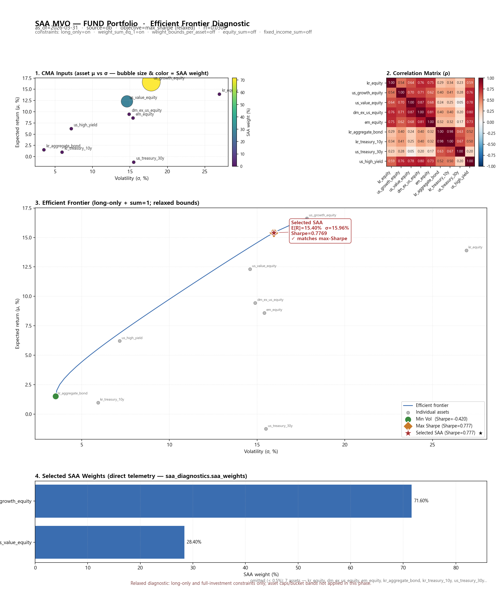

# SAA MVO / Efficient Frontier Summary (20260511)

> schema_version: e9.1
> Read-only diagnostic. Frontier 는 별도 SLSQP grid scan — production allocation 결과 미변경.

## ETF

- portfolio as_of: **2026-03-31**, source: **db**
- selected SAA: E[R]=15.40%, σ=15.96%, Sharpe=0.7769
- min-vol: E[R]=1.52%, σ=3.52%, Sharpe=-0.4205
- max-Sharpe: E[R]=15.40%, σ=15.96%, Sharpe=0.7769
- selected_matches_max_sharpe: **True**
- frontier point count: 31, failed grid points: 0

## Fund

- portfolio as_of: **2026-03-31**, source: **db**
- selected SAA: E[R]=15.40%, σ=15.96%, Sharpe=0.7769
- min-vol: E[R]=1.52%, σ=3.52%, Sharpe=-0.4205
- max-Sharpe: E[R]=15.40%, σ=15.96%, Sharpe=0.7769
- selected_matches_max_sharpe: **True**
- frontier point count: 31, failed grid points: 0

> **Constraints note**: Relaxed diagnostic — long-only + sum=1 만 적용. asset caps / bucket bands 미적용 (Phase D relaxed).
