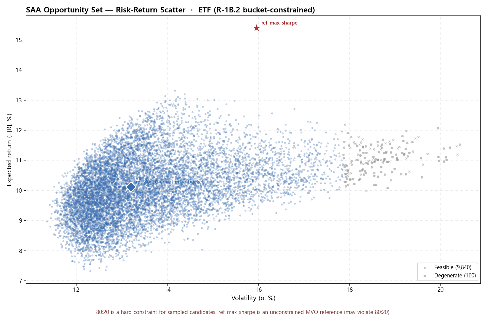
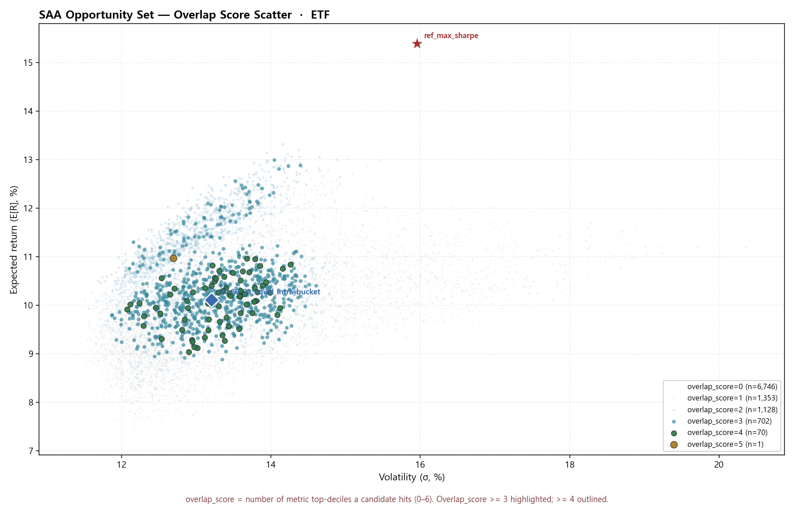
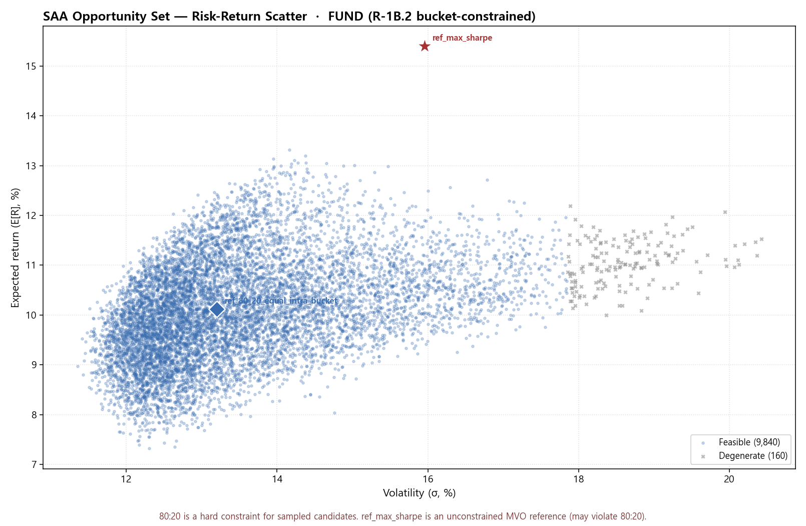
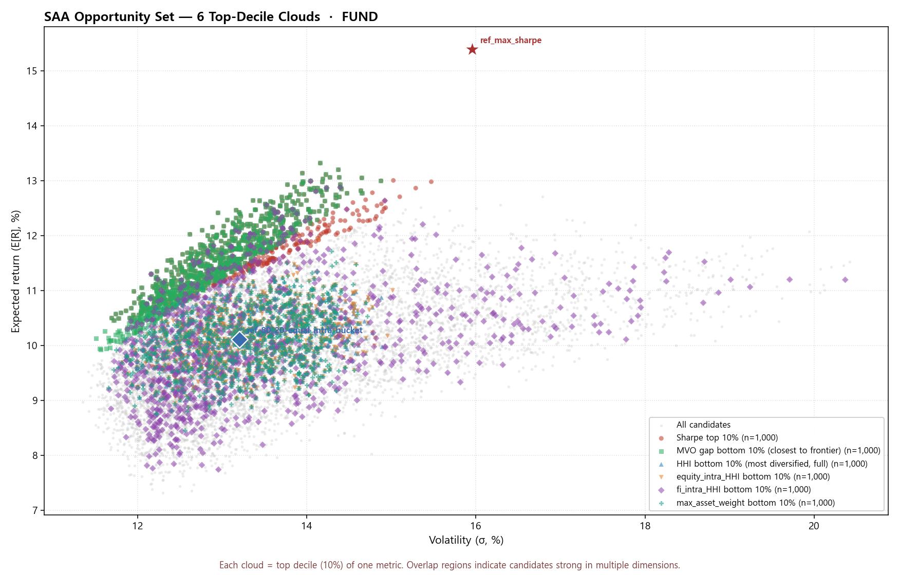
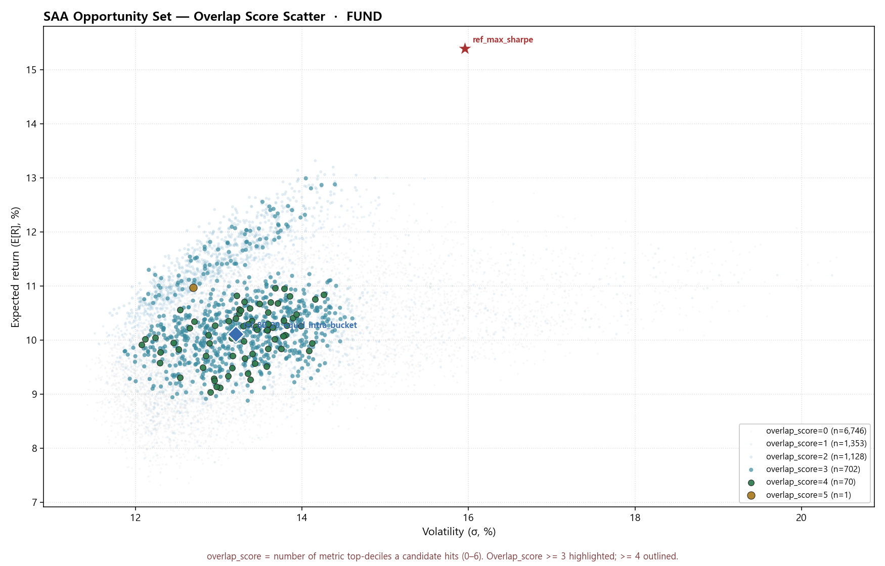

# SAA Opportunity Set — Cloud / Overlap Review (R-1C, 20260513)

> R-1C schema_version: r1c.1
> Source: R-1B.2 bucket-constrained opportunity set JSON (`saa_opportunity_set_{etf,fund}_<as_of>.json`). Read-only diagnostic.
> 모든 sampled candidate 는 equity 80% / fixed_income 20% 를 만족 (R-1B.2 hard constraint).

## ETF

- portfolio as_of: **2026-03-31**, source: **db**, scope: **R-1B-lite (R-1B.2 bucket-constrained)**
- candidates: **10,000** (feasible 9,840 / degenerate 160)
- pool_size_total: 10,002, reference: 2

### ETF · Decile thresholds (10%)

| metric | direction | threshold |
|---|---|---:|
| `sharpe` | top 10% | ≥ 0.6270 |
| `mvo_efficiency_score` | bottom 10% | ≤ 0.0147 |
| `concentration_hhi` | bottom 10% | ≤ 0.1717 |
| `equity_intra_hhi` | bottom 10% | ≤ 0.2435 |
| `fixed_income_intra_hhi` | bottom 10% | ≤ 0.2888 |
| `max_asset_weight` | bottom 10% | ≤ 25.66% |

### ETF · Reference points

- **ref_max_sharpe**: E[R]=15.40%, σ=15.96%, Sharpe=0.7769, eq=100.00%, fi=0.00%, HHI=0.5934, eq_intra_HHI=0.5934, fi_intra_HHI=n/a, mvo_gap=-0.0001
- **ref_80_20_equal_intra_bucket**: E[R]=10.12%, σ=13.20%, Sharpe=0.5389, eq=80.00%, fi=20.00%, HHI=0.1380, eq_intra_HHI=0.2000, fi_intra_HHI=0.2500, mvo_gap=0.0276

### ETF · Overlap score distribution (0–6)

| overlap_score | count |
|---:|---:|
| 0 | 6,746 |
| 1 | 1,353 |
| 2 | 1,128 |
| 3 | 702 |
| 4 | 70 |
| 5 | 1 |
| 6 | 0 |

- overlap_score ≥ 3: **773**, ≥ 4: **71**, ≥ 5: **1**, = 6: **0**

### ETF · PNG outputs

- **risk_return_scatter**: `saa_opportunity_set_etf_risk_return_scatter_20260513.png`

  
- **metric_clouds**: `saa_opportunity_set_etf_metric_clouds_20260513.png`

  
- **overlap_score**: `saa_opportunity_set_etf_overlap_score_20260513.png`

  

### ETF · Sweet spot — Top 20 by overlap_score

| # | candidate_id | overlap | E[R] | σ | Sharpe | mvo_gap | HHI | eq_intra_HHI | fi_intra_HHI | max_w | eq_max | fi_max | feas | weights (top 4) |
|---:|---|---:|---:|---:|---:|---:|---:|---:|---:|---:|---:|---:|---|---|
| 1 | cand_008421 | **5** | 10.97% | 12.69% | 0.6277 | 0.0142 | 0.1635 | 0.2330 | 0.3607 | 25.56% | 25.56% | 10.14% | feasible | us_growth_equity=25.6%, us_value_equity=21.2%, em_equity=14.3%, dm_ex_us_equity=10.9% |
| 2 | cand_005995 | **4** | 10.57% | 12.54% | 0.6033 | 0.0167 | 0.1650 | 0.2403 | 0.2807 | 25.59% | 25.59% | 7.99% | feasible | us_growth_equity=25.6%, em_equity=21.1%, us_value_equity=17.6%, dm_ex_us_equity=9.2% |
| 3 | cand_009678 | **4** | 10.82% | 13.21% | 0.5918 | 0.0206 | 0.1541 | 0.2244 | 0.2627 | 23.64% | 23.64% | 6.57% | feasible | us_value_equity=23.6%, us_growth_equity=20.8%, kr_equity=15.6%, dm_ex_us_equity=10.7% |
| 4 | cand_005991 | **4** | 10.97% | 13.68% | 0.5823 | 0.0236 | 0.1650 | 0.2412 | 0.2652 | 23.15% | 23.15% | 6.96% | feasible | us_value_equity=23.1%, us_growth_equity=21.0%, kr_equity=20.9%, em_equity=10.4% |
| 5 | cand_000758 | **4** | 10.71% | 13.31% | 0.5794 | 0.0226 | 0.1546 | 0.2235 | 0.2882 | 22.98% | 22.98% | 8.34% | feasible | us_growth_equity=23.0%, us_value_equity=18.2%, kr_equity=16.4%, dm_ex_us_equity=16.3% |
| 6 | cand_001870 | **4** | 10.02% | 12.12% | 0.5791 | 0.0181 | 0.1657 | 0.2408 | 0.2882 | 23.07% | 23.07% | 6.79% | feasible | us_value_equity=23.1%, us_growth_equity=21.3%, em_equity=16.6%, dm_ex_us_equity=16.5% |
| 7 | cand_003747 | **4** | 10.35% | 12.71% | 0.5782 | 0.0205 | 0.1576 | 0.2299 | 0.2610 | 22.40% | 22.40% | 6.05% | feasible | us_value_equity=22.4%, dm_ex_us_equity=21.4%, us_growth_equity=18.9%, kr_equity=10.1% |
| 8 | cand_002502 | **4** | 10.95% | 13.79% | 0.5766 | 0.0248 | 0.1629 | 0.2382 | 0.2632 | 20.69% | 20.69% | 6.27% | feasible | us_value_equity=20.7%, us_growth_equity=20.6%, kr_equity=20.6%, dm_ex_us_equity=15.5% |
| 9 | cand_001224 | **4** | 10.05% | 12.24% | 0.5761 | 0.0189 | 0.1588 | 0.2321 | 0.2564 | 22.29% | 22.29% | 6.34% | feasible | us_value_equity=22.3%, em_equity=21.4%, us_growth_equity=19.5%, dm_ex_us_equity=10.6% |
| 10 | cand_007510 | **4** | 9.91% | 12.08% | 0.5724 | 0.0188 | 0.1644 | 0.2400 | 0.2702 | 23.35% | 23.35% | 6.75% | feasible | dm_ex_us_equity=23.3%, us_growth_equity=20.8%, us_value_equity=19.1%, em_equity=13.6% |
| 11 | cand_005824 | **4** | 10.57% | 13.25% | 0.5713 | 0.0235 | 0.1484 | 0.2141 | 0.2837 | 23.38% | 23.38% | 7.68% | feasible | us_growth_equity=23.4%, em_equity=17.9%, kr_equity=14.2%, dm_ex_us_equity=13.0% |
| 12 | cand_002657 | **4** | 10.22% | 12.65% | 0.5708 | 0.0212 | 0.1643 | 0.2390 | 0.2830 | 24.84% | 24.84% | 7.82% | feasible | us_growth_equity=24.8%, dm_ex_us_equity=23.5%, us_value_equity=13.2%, em_equity=12.0% |
| 13 | cand_009539 | **4** | 10.55% | 13.26% | 0.5692 | 0.0238 | 0.1461 | 0.2112 | 0.2734 | 22.96% | 22.96% | 7.22% | feasible | us_growth_equity=23.0%, dm_ex_us_equity=15.8%, em_equity=15.3%, kr_equity=14.4% |
| 14 | cand_007692 | **4** | 10.68% | 13.49% | 0.5690 | 0.0247 | 0.1525 | 0.2210 | 0.2759 | 21.08% | 21.08% | 7.08% | feasible | us_growth_equity=21.1%, dm_ex_us_equity=17.9%, kr_equity=17.6%, us_value_equity=17.5% |
| 15 | cand_003635 | **4** | 10.59% | 13.37% | 0.5673 | 0.0245 | 0.1642 | 0.2387 | 0.2856 | 23.45% | 23.45% | 6.94% | feasible | us_growth_equity=23.5%, dm_ex_us_equity=21.8%, kr_equity=16.5%, us_value_equity=14.8% |
| 16 | cand_006038 | **4** | 10.49% | 13.25% | 0.5657 | 0.0242 | 0.1451 | 0.2104 | 0.2622 | 21.05% | 21.05% | 6.29% | feasible | us_growth_equity=21.1%, dm_ex_us_equity=19.1%, kr_equity=15.4%, us_value_equity=13.3% |
| 17 | cand_004225 | **4** | 10.70% | 13.62% | 0.5653 | 0.0257 | 0.1462 | 0.2107 | 0.2852 | 19.57% | 19.57% | 7.22% | feasible | kr_equity=19.6%, us_growth_equity=18.5%, dm_ex_us_equity=16.7%, us_value_equity=16.2% |
| 18 | cand_007340 | **4** | 10.81% | 13.85% | 0.5641 | 0.0267 | 0.1563 | 0.2266 | 0.2813 | 23.98% | 23.98% | 7.11% | feasible | us_growth_equity=24.0%, kr_equity=20.4%, em_equity=15.7%, dm_ex_us_equity=12.6% |
| 19 | cand_008938 | **4** | 10.27% | 12.95% | 0.5616 | 0.0236 | 0.1583 | 0.2304 | 0.2721 | 23.42% | 23.42% | 7.42% | feasible | us_growth_equity=23.4%, em_equity=23.2%, dm_ex_us_equity=14.1%, kr_equity=10.7% |
| 20 | cand_004926 | **4** | 10.35% | 13.12% | 0.5606 | 0.0244 | 0.1533 | 0.2220 | 0.2790 | 24.70% | 24.70% | 7.20% | feasible | us_value_equity=24.7%, dm_ex_us_equity=16.3%, us_growth_equity=16.0%, kr_equity=15.0% |

## Fund

- portfolio as_of: **2026-03-31**, source: **db**, scope: **R-1B-lite (R-1B.2 bucket-constrained)**
- candidates: **10,000** (feasible 9,840 / degenerate 160)
- pool_size_total: 10,002, reference: 2

### Fund · Decile thresholds (10%)

| metric | direction | threshold |
|---|---|---:|
| `sharpe` | top 10% | ≥ 0.6270 |
| `mvo_efficiency_score` | bottom 10% | ≤ 0.0147 |
| `concentration_hhi` | bottom 10% | ≤ 0.1717 |
| `equity_intra_hhi` | bottom 10% | ≤ 0.2435 |
| `fixed_income_intra_hhi` | bottom 10% | ≤ 0.2888 |
| `max_asset_weight` | bottom 10% | ≤ 25.66% |

### Fund · Reference points

- **ref_max_sharpe**: E[R]=15.40%, σ=15.96%, Sharpe=0.7769, eq=100.00%, fi=0.00%, HHI=0.5934, eq_intra_HHI=0.5934, fi_intra_HHI=n/a, mvo_gap=-0.0001
- **ref_80_20_equal_intra_bucket**: E[R]=10.12%, σ=13.20%, Sharpe=0.5389, eq=80.00%, fi=20.00%, HHI=0.1380, eq_intra_HHI=0.2000, fi_intra_HHI=0.2500, mvo_gap=0.0276

### Fund · Overlap score distribution (0–6)

| overlap_score | count |
|---:|---:|
| 0 | 6,746 |
| 1 | 1,353 |
| 2 | 1,128 |
| 3 | 702 |
| 4 | 70 |
| 5 | 1 |
| 6 | 0 |

- overlap_score ≥ 3: **773**, ≥ 4: **71**, ≥ 5: **1**, = 6: **0**

### Fund · PNG outputs

- **risk_return_scatter**: `saa_opportunity_set_fund_risk_return_scatter_20260513.png`

  
- **metric_clouds**: `saa_opportunity_set_fund_metric_clouds_20260513.png`

  
- **overlap_score**: `saa_opportunity_set_fund_overlap_score_20260513.png`

  

### Fund · Sweet spot — Top 20 by overlap_score

| # | candidate_id | overlap | E[R] | σ | Sharpe | mvo_gap | HHI | eq_intra_HHI | fi_intra_HHI | max_w | eq_max | fi_max | feas | weights (top 4) |
|---:|---|---:|---:|---:|---:|---:|---:|---:|---:|---:|---:|---:|---|---|
| 1 | cand_008421 | **5** | 10.97% | 12.69% | 0.6277 | 0.0142 | 0.1635 | 0.2330 | 0.3607 | 25.56% | 25.56% | 10.14% | feasible | us_growth_equity=25.6%, us_value_equity=21.2%, em_equity=14.3%, dm_ex_us_equity=10.9% |
| 2 | cand_005995 | **4** | 10.57% | 12.54% | 0.6033 | 0.0167 | 0.1650 | 0.2403 | 0.2807 | 25.59% | 25.59% | 7.99% | feasible | us_growth_equity=25.6%, em_equity=21.1%, us_value_equity=17.6%, dm_ex_us_equity=9.2% |
| 3 | cand_009678 | **4** | 10.82% | 13.21% | 0.5918 | 0.0206 | 0.1541 | 0.2244 | 0.2627 | 23.64% | 23.64% | 6.57% | feasible | us_value_equity=23.6%, us_growth_equity=20.8%, kr_equity=15.6%, dm_ex_us_equity=10.7% |
| 4 | cand_005991 | **4** | 10.97% | 13.68% | 0.5823 | 0.0236 | 0.1650 | 0.2412 | 0.2652 | 23.15% | 23.15% | 6.96% | feasible | us_value_equity=23.1%, us_growth_equity=21.0%, kr_equity=20.9%, em_equity=10.4% |
| 5 | cand_000758 | **4** | 10.71% | 13.31% | 0.5794 | 0.0226 | 0.1546 | 0.2235 | 0.2882 | 22.98% | 22.98% | 8.34% | feasible | us_growth_equity=23.0%, us_value_equity=18.2%, kr_equity=16.4%, dm_ex_us_equity=16.3% |
| 6 | cand_001870 | **4** | 10.02% | 12.12% | 0.5791 | 0.0181 | 0.1657 | 0.2408 | 0.2882 | 23.07% | 23.07% | 6.79% | feasible | us_value_equity=23.1%, us_growth_equity=21.3%, em_equity=16.6%, dm_ex_us_equity=16.5% |
| 7 | cand_003747 | **4** | 10.35% | 12.71% | 0.5782 | 0.0205 | 0.1576 | 0.2299 | 0.2610 | 22.40% | 22.40% | 6.05% | feasible | us_value_equity=22.4%, dm_ex_us_equity=21.4%, us_growth_equity=18.9%, kr_equity=10.1% |
| 8 | cand_002502 | **4** | 10.95% | 13.79% | 0.5766 | 0.0248 | 0.1629 | 0.2382 | 0.2632 | 20.69% | 20.69% | 6.27% | feasible | us_value_equity=20.7%, us_growth_equity=20.6%, kr_equity=20.6%, dm_ex_us_equity=15.5% |
| 9 | cand_001224 | **4** | 10.05% | 12.24% | 0.5761 | 0.0189 | 0.1588 | 0.2321 | 0.2564 | 22.29% | 22.29% | 6.34% | feasible | us_value_equity=22.3%, em_equity=21.4%, us_growth_equity=19.5%, dm_ex_us_equity=10.6% |
| 10 | cand_007510 | **4** | 9.91% | 12.08% | 0.5724 | 0.0188 | 0.1644 | 0.2400 | 0.2702 | 23.35% | 23.35% | 6.75% | feasible | dm_ex_us_equity=23.3%, us_growth_equity=20.8%, us_value_equity=19.1%, em_equity=13.6% |
| 11 | cand_005824 | **4** | 10.57% | 13.25% | 0.5713 | 0.0235 | 0.1484 | 0.2141 | 0.2837 | 23.38% | 23.38% | 7.68% | feasible | us_growth_equity=23.4%, em_equity=17.9%, kr_equity=14.2%, dm_ex_us_equity=13.0% |
| 12 | cand_002657 | **4** | 10.22% | 12.65% | 0.5708 | 0.0212 | 0.1643 | 0.2390 | 0.2830 | 24.84% | 24.84% | 7.82% | feasible | us_growth_equity=24.8%, dm_ex_us_equity=23.5%, us_value_equity=13.2%, em_equity=12.0% |
| 13 | cand_009539 | **4** | 10.55% | 13.26% | 0.5692 | 0.0238 | 0.1461 | 0.2112 | 0.2734 | 22.96% | 22.96% | 7.22% | feasible | us_growth_equity=23.0%, dm_ex_us_equity=15.8%, em_equity=15.3%, kr_equity=14.4% |
| 14 | cand_007692 | **4** | 10.68% | 13.49% | 0.5690 | 0.0247 | 0.1525 | 0.2210 | 0.2759 | 21.08% | 21.08% | 7.08% | feasible | us_growth_equity=21.1%, dm_ex_us_equity=17.9%, kr_equity=17.6%, us_value_equity=17.5% |
| 15 | cand_003635 | **4** | 10.59% | 13.37% | 0.5673 | 0.0245 | 0.1642 | 0.2387 | 0.2856 | 23.45% | 23.45% | 6.94% | feasible | us_growth_equity=23.5%, dm_ex_us_equity=21.8%, kr_equity=16.5%, us_value_equity=14.8% |
| 16 | cand_006038 | **4** | 10.49% | 13.25% | 0.5657 | 0.0242 | 0.1451 | 0.2104 | 0.2622 | 21.05% | 21.05% | 6.29% | feasible | us_growth_equity=21.1%, dm_ex_us_equity=19.1%, kr_equity=15.4%, us_value_equity=13.3% |
| 17 | cand_004225 | **4** | 10.70% | 13.62% | 0.5653 | 0.0257 | 0.1462 | 0.2107 | 0.2852 | 19.57% | 19.57% | 7.22% | feasible | kr_equity=19.6%, us_growth_equity=18.5%, dm_ex_us_equity=16.7%, us_value_equity=16.2% |
| 18 | cand_007340 | **4** | 10.81% | 13.85% | 0.5641 | 0.0267 | 0.1563 | 0.2266 | 0.2813 | 23.98% | 23.98% | 7.11% | feasible | us_growth_equity=24.0%, kr_equity=20.4%, em_equity=15.7%, dm_ex_us_equity=12.6% |
| 19 | cand_008938 | **4** | 10.27% | 12.95% | 0.5616 | 0.0236 | 0.1583 | 0.2304 | 0.2721 | 23.42% | 23.42% | 7.42% | feasible | us_growth_equity=23.4%, em_equity=23.2%, dm_ex_us_equity=14.1%, kr_equity=10.7% |
| 20 | cand_004926 | **4** | 10.35% | 13.12% | 0.5606 | 0.0244 | 0.1533 | 0.2220 | 0.2790 | 24.70% | 24.70% | 7.20% | feasible | us_value_equity=24.7%, dm_ex_us_equity=16.3%, us_growth_equity=16.0%, kr_equity=15.0% |

---

> **Note**: cloud overlap 은 후보를 추천하지 않는다 — 운용역이 정책 가중치를 반영해 최종 SAA 를 선택한다. 추가 정밀 query (특정 σ/E[R] 점 근처 검색) 는 R-1D similar_search 진입 시 구현.
