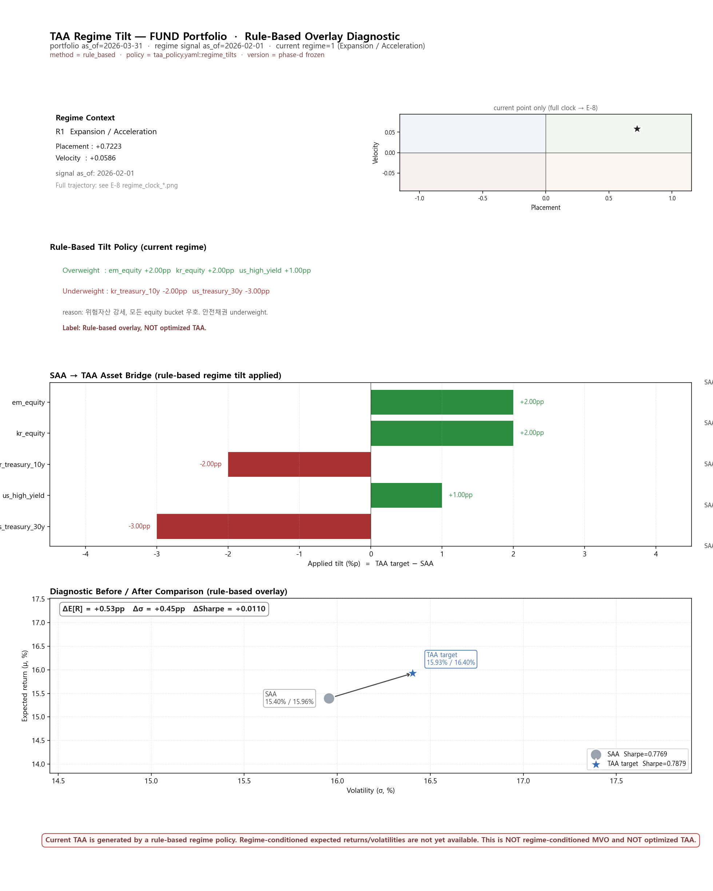

# TAA Regime Tilt Summary (20260511)

> schema_version: e10.1
> Current TAA is generated by a rule-based regime policy. Regime-conditioned expected returns/volatilities are not yet available. This is NOT regime-conditioned MVO and NOT optimized TAA.

## ETF

- regime: **R1 Expansion / Acceleration**, P=+0.7223, V=+0.0586
- portfolio as_of=2026-03-31, regime signal as_of=2026-02-01
- SAA: E[R]=15.40%, σ=15.96%, Sharpe=0.7769
- TAA: E[R]=15.93%, σ=16.40%, Sharpe=0.7879
- Δ: E[R]=+0.53pp, σ=+0.45pp, Sharpe=+0.0110
- Applied tilts:
  - em_equity: SAA 0.00% → TAA 2.00% (tilt +2.00pp, overweight)
  - kr_equity: SAA 0.00% → TAA 2.00% (tilt +2.00pp, overweight)
  - kr_treasury_10y: SAA 0.00% → TAA -2.00% (tilt -2.00pp, underweight)
  - us_high_yield: SAA 0.00% → TAA 1.00% (tilt +1.00pp, overweight)
  - us_treasury_30y: SAA 0.00% → TAA -3.00% (tilt -3.00pp, underweight)

## Fund

- regime: **R1 Expansion / Acceleration**, P=+0.7223, V=+0.0586
- portfolio as_of=2026-03-31, regime signal as_of=2026-02-01
- SAA: E[R]=15.40%, σ=15.96%, Sharpe=0.7769
- TAA: E[R]=15.93%, σ=16.40%, Sharpe=0.7879
- Δ: E[R]=+0.53pp, σ=+0.45pp, Sharpe=+0.0110
- Applied tilts:
  - em_equity: SAA 0.00% → TAA 2.00% (tilt +2.00pp, overweight)
  - kr_equity: SAA 0.00% → TAA 2.00% (tilt +2.00pp, overweight)
  - kr_treasury_10y: SAA 0.00% → TAA -2.00% (tilt -2.00pp, underweight)
  - us_high_yield: SAA 0.00% → TAA 1.00% (tilt +1.00pp, overweight)
  - us_treasury_30y: SAA 0.00% → TAA -3.00% (tilt -3.00pp, underweight)

---

**Limitation**: Current TAA is generated by a rule-based regime policy. Regime-conditioned expected returns/volatilities are not yet available. This is NOT regime-conditioned MVO and NOT optimized TAA.
